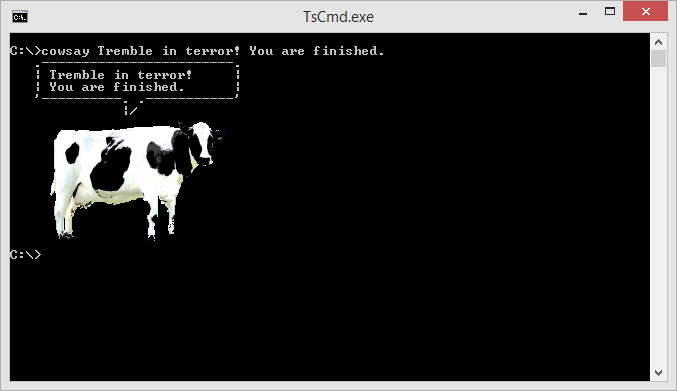

Cowsay for Windows
==================

Finally, the best reason to run Linux has arrived on the Windows platform. Wake
the kids and let them know.

Designed from the ground up to natively support the Windows Command Prompt,
this is one time you won't be able to tell you're running a port.

### Usage ###

Set the environment variable "COWSAY_LOCATION" to a directory holding all of
your favorite cow bitmaps. Then do this:

    cowsay stuff to say

### Advanced Usage ###

    cowsay -c image_name stuff to say

### Example ###

### Credits ###

The cow image was taken from Wikipedia were it had been assigned from the public domain and was credited as follows:

Keith Weller/USDA - www.ars.usda.gov: Image Number K5176-3

http://en.wikipedia.org/wiki/Cattle#mediaviewer/File:Cow_female_black_white.jpg
